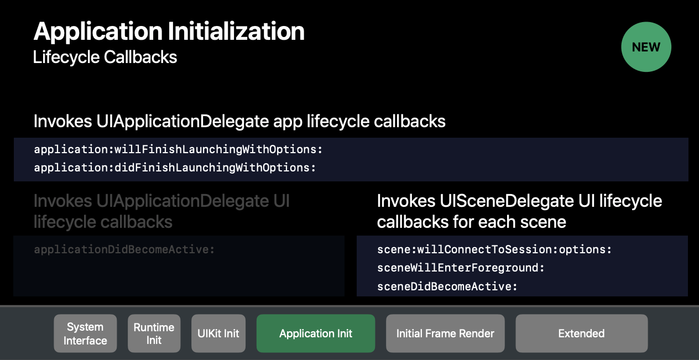

# iOS13-Adaptive

### 关于 DarkMode 的适配

https://www.jianshu.com/p/27f5df87cc16

https://www.jianshu.com/p/7925bd51d2d6

### 关于 SceneDelegate

Appdelegate 的 - (BOOL)application:(UIApplication *)application didFinishLaunchingWithOptions:(NSDictionary *)launchOptions方法中创建根控制器，会崩溃报错：

[AppDelegate setWindow:] unrecognized selector sent to instance...

AppDelegate 找不到设置 window 的方法了

iOS 13 之后，Appdelegate 不在负责UI生命周期，所有的UI生命周期交给 SceneDelegate 处理：



```
- (void)scene:(UIScene *)scene willConnectToSession:(UISceneSession *)session options:(UISceneConnectionOptions *)connectionOptions {

    UIWindowScene *windowScene = (UIWindowScene *)scene;
    self.window = [[UIWindow alloc] initWithWindowScene:windowScene];
    self.window.frame = windowScene.coordinateSpace.bounds;
    self.window.rootViewController = [UITabBarController new];
    [self.window makeKeyAndVisible];
}
```

